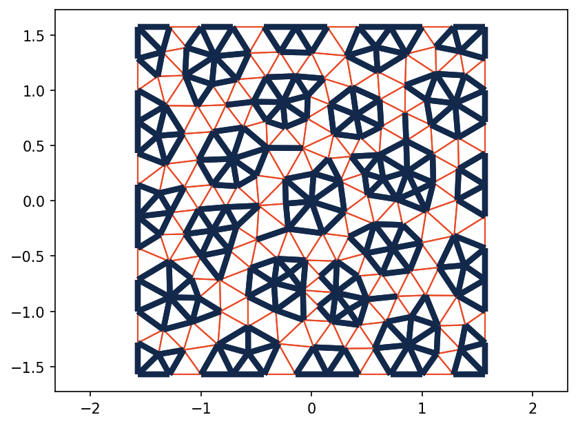
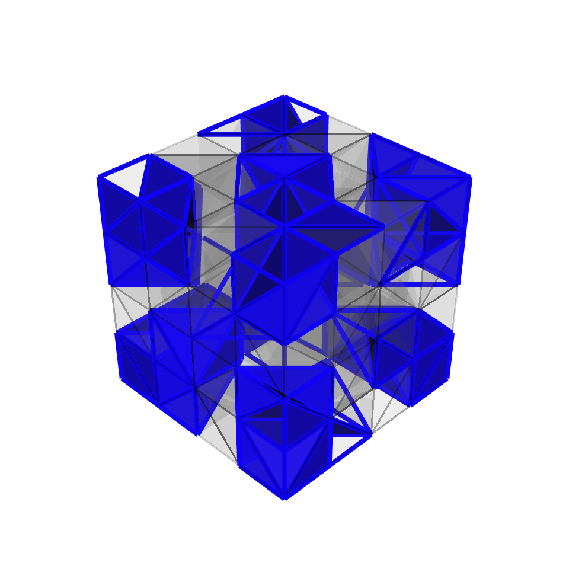
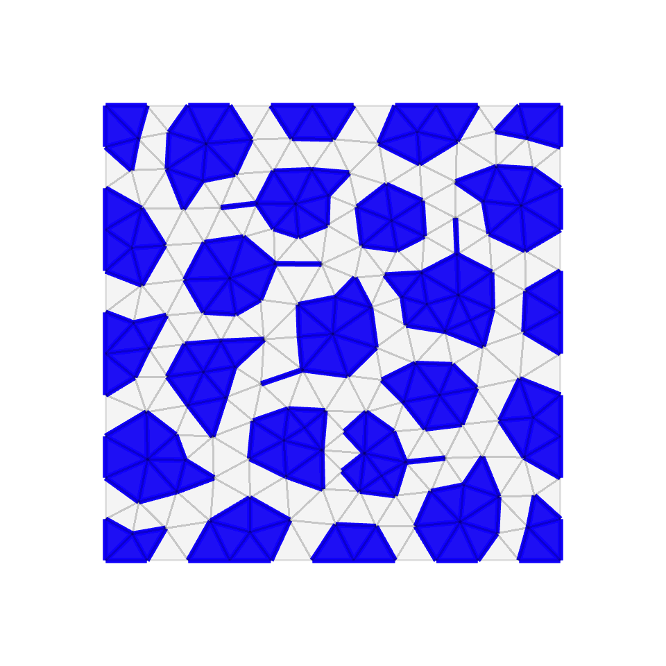

This is a collection of short examples for [PyAMG](https://github.com/pyamg/pyamg).
The source code for these **(and more)** examples is available at
https://github.com/pyamg/pyamg-examples.

### Table of Contents
- **<a href="#blackboxsolver">Blackbox Solver</a>**
- **<a href="#smoothedaggregationamg">Smoothed Aggregation AMG</a>**
- **<a href="#classicalamg">Classical AMG</a>**
- **<a href="#rootnodeamg">Rootnode AMG</a>**
- **<a href="#finiteelements">Finite Elements</a>**
- **<a href="#preconditioning">Preconditioning</a>**
- **<a href="#otherapplications">Other Applications</a>**

<a name="blackboxsolver"></a>
### Blackbox Solver

[demo.py](https://github.com/pyamg/pyamg-examples/blob/master/blackbox/demo.py)

This demo highlights using PyAMG's `blackbox` module, which attempts to solve
an arbitrary system `A x = b` with minimal input.  The matrix `A` can be
non-Hermitian, indefinite, Hermitian positive-definite, etc...  The method tries
generic and
robust settings for `smoothed_aggregation_solver(..)`.  If
`solve()` fails to effectively solve the system,
then it may be helpful to look at the demo in `solver_diagonstics`
for guidance on automatically finding better parameter settings.

To use `solve()`, only the matrix `A` and a right-hand side `b` are needed:

```python
x = pyamg.solve(A, b, verb=True)
```
The demo produces residual norms that can vary from machine to machine.

```
  Detected a Hermitian matrix
    maxiter = 400
    iteration 1.0
    iteration 2.0
    iteration 3.0
    iteration 4.0
    iteration 5.0
    iteration 6.0
    iteration 7.0
  Residuals ||r_k||_M, ||r_0||_M = 6.46e-01, 8.68e+06
  Residual reduction ||r_k||_M/||r_0||_M = 7.44e-08
```

***

<a name="smoothedaggregationamg"></a>
### Smoothed Aggregation AMG


#### Aggregation

[demo.py](https://github.com/pyamg/pyamg-examples/blob/master/aggregation/demo.py)

In this example, the first-level aggregates are shown for AMG based on smoothed aggregation.
An example mesh and adjacency matrix is loaded from `square.mat`, followed by a call to
`smoothed_aggregation_solver`.  Then the first-level aggregates are
plotted. From the figure, most aggregates encompass entire groups of
elements in the underlying mesh. Still, there are a many aggregates that yield
"strings" in the aggregation, often impacting performance.




#### One Dimensional Problem

[demo.py](https://github.com/pyamg/pyamg-examples/blob/master/one_dimension/demo.py)

This example illustrates the effect, in 1D, of smoothed aggregation on
tentative prolongation operators.  Each of the aggregates (groups of three in
this case) are plotted with the associated (smoothed) basis functions.


#### Visualizing Aggregation

[demo1.py](https://github.com/pyamg/pyamg-examples/blob/master/visualizing_aggregation/demo1.py)

[demo2.py](https://github.com/pyamg/pyamg-examples/blob/master/visualizing_aggregation/demo2.py)

In these two example the `pyamg.vis` module is called to display
aggregation in both two and three dimensions.  `demo1.py` considers the Poisson
problem on an unstructured triangulation of the unit square (from the PyAMG
gallery).  In `demo2.py`, the same Poisson problem is considered on an
unstructured tetrahedral mesh on the unit cube.  Two VTK compliant output files
are generated in each case: `output_mesh.vtu` and `output_aggs.vtu`.
`output_mesh.vtu` provides information on the underlying mesh (straight from
the unit square mesh), while `output_aggs.vtu` holds information on the
aggregates generated from first level of Smoothed Aggregation.  The process of
visulization in paraview is straightforward:

Start [Paraview](http://www.paravieworg/paraview/resources/software.php):

- open file: `output_mesh.vtu`
  - apply
  - under display in the object inspector: select wireframe representation
  - under display in the object inspector: select a better solid color
- open file: `output_aggs.vtu`
  - apply
  - under display in the object inspector: select surface with edges representation
  - under display in the object inspector: select a better solid color
  - under display in the object inspector: increase line width to see line aggregates (if present)
  - under display in the object inspector: increase point size to see point aggregates (if present)







#### Solver Diagnostics

[demo.py --matrix 2](https://github.com/pyamg/pyamg-examples/blob/master/solver_diagnostics/demo.py)

AMG has a range of parameter choices; selecting the optimal combination
can be challenging yet can lead to significant improvements in convergences.
This example highlights a "solver diagnostics" function that makes finding good parameter
choices a bit easier.  A brute force search is applied, and depending on the matrix
characteristics (e.g., symmetry and definiteness), 60-120 different solvers are
constructed and then tested.  As a result, this test is intended for smaller matrix problems.

The function `solver_diagnostics` (`solver_diagnostics.py`) has many
parameters, but the defaults should be sufficient.  For this test,
only the matrix, `A`, is needed, and `A` can be nonsymmetric, indefinite, or
symmetric positive definite.  The function detects symmetry and definiteness,
but it is safest to specify these.

The function outputs two separate files and we briefly examine this output
for the second example of rotated anisotropic diffusion when running the above
`demo.py`. 

Running

```python
python demo.py --matrix 2
```
will run solver diagnostics on the rotated anisotropic diffusion problem.

The first output file is `rot_ani_diff_diagnostic.txt`, which is a sorted table
of solver statistics for all the solvers tried.  This file has detailed output
for the performance of each solver, and the parameter choices used for
each solver.

The second file defines a function `rot_ani_diff_diagnostic.py`, that when
given a matrix, automatically generates and uses the best solver found.

```

Searching for optimal smoothed aggregation method for (2500,2500) matrix
    ...
    User specified a symmetric matrix
    User specified definiteness as positive
    ...
    Test 1 out of 18
    Test 2 out of 18
    Test 3 out of 18
    Test 4 out of 18
    Test 5 out of 18
    Test 6 out of 18
    Test 7 out of 18
    Test 8 out of 18
    Test 9 out of 18
    Test 10 out of 18
    Test 11 out of 18
    Test 12 out of 18
    Test 13 out of 18
    Test 14 out of 18
    Test 15 out of 18
    Test 16 out of 18
    Test 17 out of 18
    Test 18 out of 18
    --> Diagnostic Results located in rot_ani_diff_diagnostic.txt
    --> See automatically generated function definition in rot_ani_diff_diagnostic.py
```

***

<a name="classicalamg"></a>
### Classical AMG


***

<a name="rootnodeamg"></a>
### Rootnode AMG


***

<a name="finiteelements"></a>
### Finite Elements


***

<a name="preconditioning"></a>
### Preconditioning


***

<a name="otherapplications"></a>
### Other Applications


***

