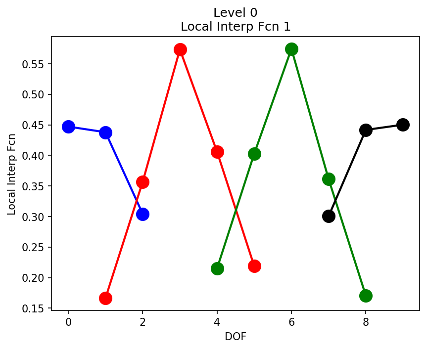
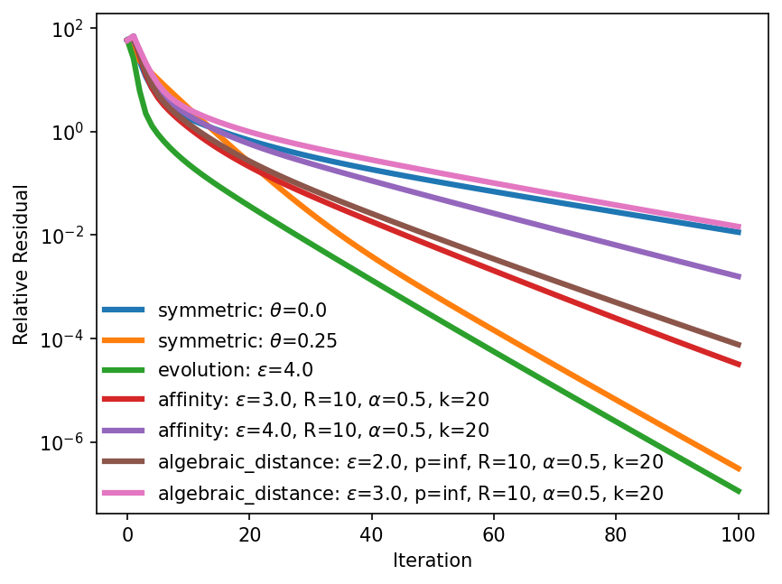
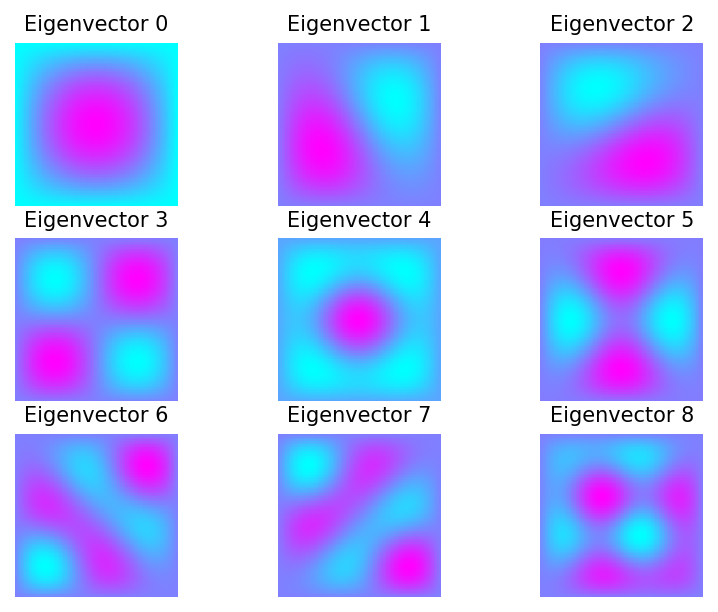
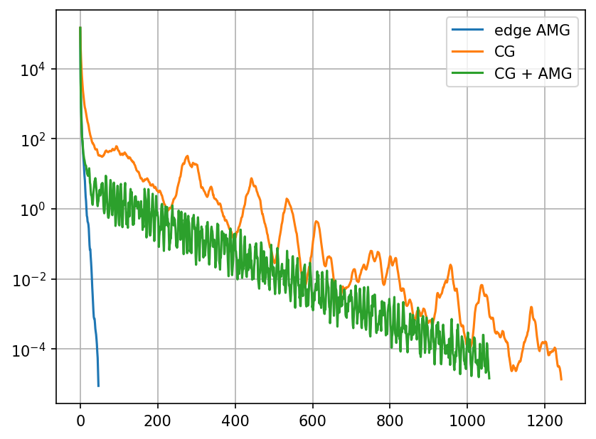
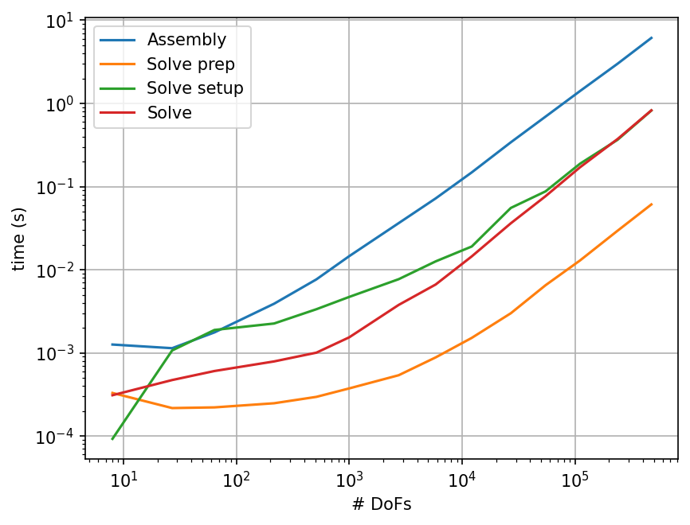

This is a collection of short examples for [PyAMG](https://github.com/pyamg/pyamg).
The source code for these **(and more)** examples is available at
https://github.com/pyamg/pyamg-examples.

### Table of Contents
- **<a href="#introduction">Introduction</a>**
  - <a href="#overview">Overview</a>
- **<a href="#blackboxsolver">Blackbox Solver</a>**
- **<a href="#smoothedaggregationamg">Smoothed Aggregation AMG</a>**
  - <a href="#aggregation">Aggregation</a>
  - <a href="#onedimensionalproblem">One Dimensional Problem</a>
  - <a href="#visualizingaggregation">Visualizing Aggregation</a>
  - <a href="#solverdiagnostics">Solver Diagnostics</a>
  - <a href="#complexarithmetic">Complex Arithmetic</a>
  - <a href="#nonsymmetricexample">Nonsymmetric example</a>
- **<a href="#classicalamg">Classical AMG</a>**
  - <a href="#coarsefinesplitting">Coarse Fine Splitting</a>
  - <a href="#compatiblerelaxation">Compatible Relaxation</a>
  - <a href="#stengthofconnection">Stength of Connection</a>
  - <a href="#approximateidealrestriction(air)">Approximate ideal restriction (AIR)</a>
- **<a href="#rootnodeamg">Rootnode AMG</a>**
  - <a href="#rootnodeamg">Rootnode AMG</a>
- **<a href="#finiteelements">Finite Elements</a>**
  - <a href="#anisotropicdiffusion">Anisotropic Diffusion</a>
  - <a href="#linearelasticity">Linear Elasticity</a>
- **<a href="#preconditioning">Preconditioning</a>**
  - <a href="#krylovmethods">Krylov Methods</a>
  - <a href="#eigenvaluesolvers">Eigenvalue Solvers</a>
- **<a href="#otherapplications">Other Applications</a>**
  - <a href="#graphpartitioning">Graph Partitioning</a>
  - <a href="#indefinitehelmholtz">Indefinite Helmholtz</a>
  - <a href="#high-orderdgonpoisson">High-Order DG on Poisson</a>
  - <a href="#edge-basedamg">Edge-based AMG</a>
- **<a href="#other">Other</a>**
  - <a href="#profilingperformance">Profiling Performance</a>
  - <a href="#scalingperformanceofamgandfeassembly">Scaling performance of AMG and FE assembly</a>

<a name="introduction"></a>
### Introduction

<a name="overview"></a>

#### Overview

[demo.py](./0_start_here/demo.py)

As a starting example, this demo considers a rotated anisotropic
diffusion problem from the `pyamg.gallery`.  First, a basic
smoothed aggregation solver is constructed.  Then, many of the
options are modified to yield a more effective solver.

The comments in `demo.py` follow several steps that walk through the demo:

- Step 1: import scipy and pyamg packages
- Step 2: setup up the system using pyamg.gallery
- Step 3: setup of the multigrid hierarchy
- Step 4: solve the system
- Step 5: print details
- Step 6: change the hierarchy
- Step 7: print details
- Step 8: plot convergence history


***

<a name="blackboxsolver"></a>
### Blackbox Solver

[demo.py](./blackbox/demo.py)

This demo highlights using PyAMG's `blackbox` module, which attempts to solve
an arbitrary system `A x = b` with minimal input.  The matrix `A` can be
non-Hermitian, indefinite, Hermitian positive-definite, etc...  The method tries
generic and
robust settings for `smoothed_aggregation_solver(..)`.  If
`solve()` fails to effectively solve the system,
then it may be helpful to look at the demo in `solver_diagonstics`
for guidance on automatically finding better parameter settings.

To use `solve()`, only the matrix `A` and a right-hand side `b` are needed:

```python
x = pyamg.solve(A, b, verb=True)
```
The demo produces residual norms that can vary from machine to machine.

***

<a name="smoothedaggregationamg"></a>
### Smoothed Aggregation AMG

<a name="aggregation"></a>

#### Aggregation

[demo.py](./aggregation/demo.py)

In this example, the first-level aggregates are shown for AMG based on smoothed aggregation.
An example mesh and adjacency matrix is loaded from `square.mat`, followed by a call to
`smoothed_aggregation_solver`.  Then the first-level aggregates are
plotted. From the figure, most aggregates encompass entire groups of
elements in the underlying mesh. Still, there are a many aggregates that yield
"strings" in the aggregation, often impacting performance.


<a name="onedimensionalproblem"></a>

#### One Dimensional Problem

[demo.py](./one_dimension/demo.py)

This example illustrates the effect, in 1D, of smoothed aggregation on
tentative prolongation operators.  Each of the aggregates (groups of three in
this case) are plotted with the associated (smoothed) basis functions.



<a name="visualizingaggregation"></a>

#### Visualizing Aggregation

[demo1.py](./visualizing_aggregation/demo1.py)

[demo2.py](./visualizing_aggregation/demo2.py)

In these two examples, the `pyamg.vis` module is called to display
aggregation in both two and three dimensions.  `demo1.py` considers the Poisson
problem on an unstructured triangulation of the unit square (from the PyAMG
gallery).  In `demo2.py`, the same Poisson problem is considered on an
unstructured tetrahedral mesh on the unit cube.  Two VTK compliant output files
are generated in each case: `output_mesh.vtu` and `output_aggs.vtu`.
`output_mesh.vtu` provides information on the underlying mesh (straight from
the unit square mesh), while `output_aggs.vtu` holds information on the
aggregates generated from first level of Smoothed Aggregation.  The process of
visulization in paraview is straightforward:

Start [Paraview](http://www.paravieworg/paraview/resources/software.php):

- open file: `output_mesh.vtu`
  - apply
  - under display in the object inspector: select wireframe representation
  - under display in the object inspector: select a better solid color
- open file: `output_aggs.vtu`
  - apply
  - under display in the object inspector: select surface with edges representation
  - under display in the object inspector: select a better solid color
  - under display in the object inspector: increase line width to see line aggregates (if present)
  - under display in the object inspector: increase point size to see point aggregates (if present)


<a name="solverdiagnostics"></a>

#### Solver Diagnostics

[demo.py --matrix 2](./solver_diagnostics/demo.py)

AMG has a range of parameter choices; selecting the optimal combination
can be challenging yet can lead to significant improvements in convergence.
This example highlights a "solver diagnostics" function that makes finding good parameter
choices a bit easier.  A brute force search is applied, and depending on the matrix
characteristics (e.g., symmetry and definiteness), 60-120 different solvers are
constructed and then tested.  As a result, this test is intended for smaller matrix problems.

The function `solver_diagnostics` (`solver_diagnostics.py`) has many
parameters, but the defaults should be sufficient.  For this test,
only the matrix, `A`, is needed, and `A` can be nonsymmetric, indefinite, or
symmetric positive definite.  The function detects symmetry and definiteness,
but it is safest to specify these.

The function outputs two separate files and we briefly examine this output
for the second example of rotated anisotropic diffusion when running the above
`demo.py`. 

Running

```python
python demo.py --matrix 2
```
will run solver diagnostics on the rotated anisotropic diffusion problem.

The first output file is `rot_ani_diff_diagnostic.txt`, which is a sorted table
of solver statistics for all the solvers tried.  This file has detailed output
for the performance of each solver, and the parameter choices used for
each solver.

The second file defines a function `rot_ani_diff_diagnostic.py`, that when
given a matrix, automatically generates and uses the best solver found.
<a name="complexarithmetic"></a>

#### Complex Arithmetic

[demo.py --solver 1](./complex/demo.py)

The smoothed aggregation solver supports complex arithmetc and
there is no conversion to an equivalent real system.  For example, the
highlighted demo here generates a basic gauge Laplacian from quantum
chromodynamics and solves the system for a random right-hand side and random
initial guess.
   
Using
```
python demo.py --solver 1
```
results in the following.
<a name="nonsymmetricexample"></a>

#### Nonsymmetric example

[demo.py --solver 1](./nonsymmetric/demo.py)

The smoothed aggregation solver supports nonsymmetric (i.e., non-Hermitian) and
indefinite matrices, through recent advances in multigrid research. The
demo highlighted here constructs a solver for a small nonsymmetric
recirculating flow problem.  The out-of-the-box example diverges,
while more advanced options yield a convergent solver.

Using

```python
python demo.py --solver 1
```

we observe the following convergence history.

***

<a name="classicalamg"></a>
### Classical AMG

<a name="coarsefinesplitting"></a>

#### Coarse Fine Splitting

[demo.py](./coarse_fine_splitting/demo.py)

The C/F splitting---i.e. the splitting of indices into strictly coarse nodes
(C-pts) and strictly fine nodes (F-pts)---using Ruge-Stuben coarsening is
illustrated in this example.  An example mesh and adjacency graph is loaded
from `square.mat`, `ruge_stuben_solver()` is initiated, and the first level of
C/F splitting is plotted.  Printing the multilevel object in this case shows that
the coarsening is typical: around 25% reduction in unknowns (or
coarsening-by-four), as shown below. The demo also plots the coarse-fine
splitting, with the orange C-pts and the blue F-pts.


<a name="compatiblerelaxation"></a>

#### Compatible Relaxation

[demo.py](./compatible_relaxation/demo.py)

The C/F splitting---i.e. the splitting of indices into strictly coarse nodes (C-pts)
and strictly fine nodes (F-pts)---using Compatible Relaxation is illustrated in this
example.  A 2d finite-difference matrix of the Poisson problem is used and the
coarse and fine splitting is plotted.  Coarse nodes are
highlighted orange, while fine nodes are highlighted blue.  In this case, the
coarsening is not aggressive, resulting in a coarsening-by-two.


<a name="stengthofconnection"></a>

#### Stength of Connection

[demo.py](./strength_options/demo.py)

In this example we look at several strength of connection measures, including `symmetric`,
`evolution`, `affinity`, and `algebraic_distance`.  From the output, we see the large impact
on convergence and the variability due to parameter selection.



<a name="approximateidealrestriction(air)"></a>

#### Approximate ideal restriction (AIR)

[demo.py](./air/demo.py)

We demonstrate the use of AMG based on Approximate Ideal Restriction
(AIR) to solve upwind discretiazations of advection. Here we consider
a simple 2d first-order upwind finite difference discretization of
the steady advection problem
    $(\cos(\theta),\sin(\theta)) \cdot \nabla u = 0$,
with Dirichlet inflow BCs on the left and bottom of the domain
enforced strongly.

AIR is ideal for upwind discretizations of advection-dominated problems.
For pure advection, often AIR does not need Krylov acceleration; we see
this by converging to 1e-10 residual tolerance in as little as 7
iterations. AIR operator complexity tends to be large; here we compare
using AIR with distance-1 and distance-2 restriction, and with and
without second pass coarsening. Distance-2 restriction and second-pass
coarsening will both increase operator complexity but also improve
convergence.
```python
python demo
```


***

<a name="rootnodeamg"></a>
### Rootnode AMG

<a name="rootnodeamg"></a>

#### Rootnode AMG

[demo.py](./rootnode/demo.py)

The `rootnode_solver` is a mixture of both classical and aggregation-based
approaches to AMG, with the intent to combine their strengths, while minimizing
their respective drawbacks.  As a result, this solver is more robust for some
problem types, especially anisotropic diffusion.

In terms of use, the interface to `pyamg.aggregation.rootnode_solver(...)` is
identical to `pyamg.aggregation.smoothed_aggregation_solver(...)`, meaning that
the above aggregation examples can be easily changed by simply replacing calls
to `smoothed_aggregation_solver()` with `rootnode_solver()`.

This example compares the rootnode coarsening to classical AMG's coarsening
(see the Coarse Fine Splitting Example) and to smoothed aggregation's
coarsening (see the Aggregation Example).  The rootnode approach mixes
classical AMG and smoothed aggregation, and hence has an associated C/F
splitting that splits the indices into strictly coarse (C) nodes and strictly
fine (F) nodes, and also has an associated aggregation that disjointly splits
the nodes into strongly connected neighborhoods.  Essentially, each aggregate
has one "root" C-node associated with it, that is injected between the fine and
coarse grids.

An example mesh and adjacency graph is loaded from `square.mat`, and the
`rootnode_solver()` is initiated.  Then, the first-level C/F splitting and the
first-level aggregation are plotted. Coarse nodes are highlighted orange, while
fine nodes are highlighted blue. 

In general (as well as in this example), the C/F splitting for rootnode
contains far fewer coarse nodes than for classical AMG.  In general, this fewer
number of coarse nodes is compensated by having a somewhat denser interpolation
operator than for classical AMG.


***

<a name="finiteelements"></a>
### Finite Elements

<a name="anisotropicdiffusion"></a>

#### Anisotropic Diffusion

[demo.py](./diffusion/demo.py)

This demo considers different strength measures in the SA-AMG setup phase for
finite element (Q1) discretizations of anisotropic diffusion.  In particular,
the Classic Strength Measure is compared to the Evolution Measure.  For this
example, we see that total work is reduced by using the Evolution Measure and
that a scalable convergence rate is observed with rootnode:
<a name="linearelasticity"></a>

#### Linear Elasticity

[demo.py --solver 2](./linear_elasticity/demo.py)

We consider the 2D linear elasticity problem from the pyamg gallery in this
example (corresponding to a simple finite element discretization on a regular
grid).  Three near null space modes are fed to the
`smoothed_aggregation_solver()` (relating to rotation and two types of
translation).  Smoothed aggregation and root node are ideal for this problem
and the results are apparent.  Very low operator complexities are observed and
the convergence is quick, whether you choose the root node or smoothed
aggregation solver.

Using

```python
python demo --solver 2
```

results in the following.

***

<a name="preconditioning"></a>
### Preconditioning

<a name="krylovmethods"></a>

#### Krylov Methods

[demo.py --solver 1](./preconditioning/demo.py)

This example shows how to effectively use multilevel solvers to
precondition a Krylov method. The first example considers the Poisson problem
from the pyamg gallery and uses a constant near-nullspace vector for SA-AMG.
The second example is 2D linear elasticity also from the pyamg gallery and uses
the typical three rigid body modes (rotation and translation in x and y) to
coach SA-AMG. Since both problems are symmetric and positive definite, CG
acceleration is used. The residual histories show a clear improvement in using
the SA-AMG preconditioners in both cases.

Using

```python
python demo.py --solver 1
```

produces the following.


<a name="eigenvaluesolvers"></a>

#### Eigenvalue Solvers

[demo.py](./eigensolver/demo.py)

In this this example, smoothed aggregation AMG is used to precondition the
LOBPCG eigensolver to find the lowest nine eigenmodes of a Poisson problem.
With preconditioning (`M=M` in the `loppcg` call), the computation of the
eigensubspace is extremely fast.




***

<a name="otherapplications"></a>
### Other Applications

<a name="graphpartitioning"></a>

#### Graph Partitioning

[demo.py](./mesh_partition/demo.py)

In this example, we compute a partition of a basic cracked mesh (`crack_mesh.mat`)
using the Fiedler vector (the second lowest eigenmode of the graph laplacian).
We construct a SA-AMG preconditioner to assist LOBPCG in finding the Fiedler
vector.  Positive/negative values of the Fiedler vector are plotted in
different colors, illustrating the natural splitting this mesh.


<a name="indefinitehelmholtz"></a>

#### Indefinite Helmholtz

[demo1d.py](./helmholtz/demo1d.py)

[demo2d.py](./helmholtz/demo2d.py)

The example focusses on the indefinite Helmholtz wave problem.  The first
part highlights the value in using waves to represent the near-null space, `B`.
In addition, we observe the waves to resemble the  (lowest) right singular vectors
of the problem.

In the case of 2D, discontinuous Galerkin is used, yielding multiple
degrees of freedom at each spatial location.  As a result,
the fine level (level-0) aggregates of the discontinuous
elements, largely group neighboring vertices.  The wave-like near
null-space is then enforced on the first coarse grid (level-1), resulting
in four modes.


<a name="high-orderdgonpoisson"></a>

#### High-Order DG on Poisson

[demo.py](./diffusion_dg/demo.py)

In this example we look at a 2D DG discretization of a Poisson problem.
The mesh consists of 46 elements, with p=5, leading to 21 degrees of freedom
per element.  The first figure shows that aggregation is local, leading to
a continuous first level.  The first coarse level (level1) candidate vector `B` is
also shown.


<a name="edge-basedamg"></a>

#### Edge-based AMG

[demo.py](./edge_amg/demo.py)

This example highlights the lowest order edge AMG implementation of the
Reitzinger-Schoberl algorithm.  From the convergence figure we observe
significant improvements over out-of-the-box AMG due to the use of
the specialized relaxation method (`hiptmair_smoother`).




***

<a name="other"></a>
### Other

<a name="profilingperformance"></a>

#### Profiling Performance

[demo.py](./profile_pyamg/demo.py)

This is a short example on profiling the setup phase of AMG.
Here, we use `pyinstrument` to analyze the construction of
a smoothed aggregation solver:
<a name="scalingperformanceofamgandfeassembly"></a>

#### Scaling performance of AMG and FE assembly

[demo.py](./performance/demo.py)

This demo shows the performance of finite element assembly (by way of scikit-fem)
and multigrid setup/solve (within PCG).  The solver is run to a tolerance of `1e-8`.
The figure shows:

- `DoFs`: the total number of degrees of freedom in the system
- `Assembly`: the total time to assemble the FE matrix (scikit-fem)
- `Solve prep`: the total time to condense the system to non-Dirichlet nodes (scikit-fem)
- `Solve setup`: the total time for the AMG setup phase (pyamg)
- `Solve`: the total time for the AMG solve phase (pyamg) withing PCG (scikit-fem)

```
| N | DoFs | Assembly | Solve prep | Solve setup | Solve |
| ---- | ---- | ---- | ---- | ---- | ---- |
|          4 |          8 |    0.00126 |    0.00033 |    0.00009 |    0.00031 |
|          5 |         27 |    0.00114 |    0.00022 |    0.00107 |    0.00047 |
|          6 |         64 |    0.00176 |    0.00022 |    0.00188 |    0.00060 |
|          8 |        216 |    0.00390 |    0.00025 |    0.00225 |    0.00079 |
|         10 |        512 |    0.00765 |    0.00030 |    0.00335 |    0.00100 |
|         12 |       1000 |    0.01455 |    0.00037 |    0.00471 |    0.00154 |
|         16 |       2744 |    0.03633 |    0.00054 |    0.00769 |    0.00377 |
|         20 |       5832 |    0.07202 |    0.00088 |    0.01259 |    0.00664 |
|         25 |      12167 |    0.14798 |    0.00151 |    0.01900 |    0.01445 |
|         32 |      27000 |    0.34047 |    0.00299 |    0.05530 |    0.03615 |
|         40 |      54872 |    0.69410 |    0.00651 |    0.08755 |    0.07666 |
|         50 |     110592 |    1.40617 |    0.01289 |    0.18790 |    0.17025 |
|         64 |     238328 |    3.00156 |    0.02943 |    0.36527 |    0.37301 |
|         80 |     474552 |    6.12799 |    0.06094 |    0.82126 |    0.82453 |
```




***

